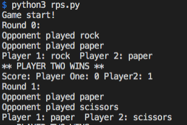

## Rock Paper Scissors

A python program that plays a game of Rock paper Scissors between a human player and a computer player. The compute strategy can be changed by selecting one of the three `Player` subclasses.

### To Run 

Run directly from the terminal 

`python3 rps.py` 

### Game Output 

